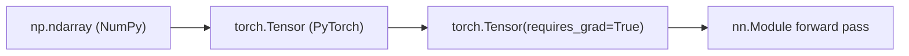

## Why this level matters (lineage)

**Classical root:** Kenneth Iverson's **APL** (1962) treated arrays as first-class values and collapsed loops into single operators. The S and later **S-PLUS** languages (1976 onward, Bell Labs) brought vectorized thinking into statistics.
**Modern descendant:** **NumPy** (2006) inherited both ideas and became the substrate for SciPy, pandas, scikit-learn, Matplotlib, JAX, and the tensor layer of **PyTorch**. The `ndarray` you type today is a direct grandchild of Iverson's array operators — and a `torch.Tensor` is an `ndarray` plus autograd.

## Luminary spotlight — Travis Oliphant

Travis Oliphant is a physicist-turned-programmer who, in 2005–2006, merged the two warring array libraries of the time (Numeric and numarray) into a single project he called **NumPy**. He wrote much of the reference book himself while an assistant professor at BYU, co-founded SciPy, and later founded **Anaconda** (the distribution now on millions of scientific workstations) and **Quansight**. He has been candid about the burnout that came with maintaining free infrastructure the entire industry depends on — a recurring theme in the history of scientific Python. The whole modern ML stack sits, directly or indirectly, on code he wrote or stewarded.

## Objectives

- Confirm that `numpy`, `matplotlib`, and `torch` all import cleanly in your F01 environment.
- Build intuition for **vectorized thinking**: what does it mean to add a scalar to an array, or to let shapes "broadcast"?
- See the conceptual bridge from a raw array to a tensor that can track gradients.

## Resources

- [NumPy quickstart](https://numpy.org/doc/stable/user/quickstart.html) — read the first three sections only.
- [Matplotlib pyplot tutorial](https://matplotlib.org/stable/tutorials/pyplot.html) — skim.
- [PyTorch — Tensors](https://pytorch.org/tutorials/beginner/basics/tensorqs_tutorial.html) — skim; you are not doing deep learning yet, only meeting the data type.

## Tasks

- [ ] Verify imports. From `notes/F03.py`, run:
  ```python
  import numpy as np
  import matplotlib.pyplot as plt
  import torch
  print(np.__version__, torch.__version__)
  ```
- [ ] Play with **broadcasting**. Type each line and predict the output before running:
  ```python
  a = np.array([1, 2, 3])
  print(a + 10)          # scalar broadcasts across the array
  print(a * np.array([[1], [2]]))  # column vector broadcasts across rows
  ```
- [ ] Plot a sine wave:
  ```python
  x = np.linspace(0, 2 * np.pi, 200)
  plt.plot(x, np.sin(x))
  plt.savefig("notes/F03_sine.png")
  ```
- [ ] Convert an array to a tensor and back, and peek at `requires_grad`:
  ```python
  t = torch.tensor([1.0, 2.0, 3.0], requires_grad=True)
  print(t, t.numpy() if not t.requires_grad else t.detach().numpy())
  ```

## Done criteria

You can explain, in one sentence each, what NumPy, Matplotlib, and PyTorch do, and you have produced at least one saved plot and one tensor with `requires_grad=True`.

## Bridge to modern



Every neural network you will ever train is, at the bottom, a pile of broadcasts over `ndarray`-shaped memory, wrapped by autograd. Getting comfortable with array thinking now pays compound interest in every later level.
