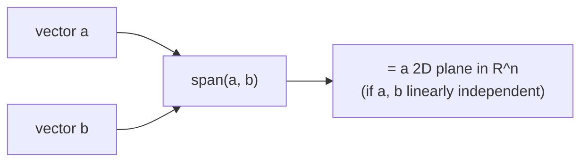

## Why this level matters (lineage)

**Classical root:** Hermann Grassmann's *Die lineale Ausdehnungslehre* (1844) was the first work to define what we now call a **vector space** abstractly — not as arrows in physical space, but as *any* set closed under addition and scalar multiplication.
**Modern descendant:** An LLM **token embedding** is literally a vector in $\mathbb{R}^{d}$ (e.g. $d = 4096$). "King − Man + Woman ≈ Queen" is not a metaphor — it is a **linear combination** in the exact sense Grassmann defined. Every retrieval system, every diffusion latent, every attention head operates in a vector space.

## Luminary spotlight — Hermann Grassmann (1809–1877)

Grassmann was a German schoolteacher who never held a university post in mathematics. In 1844 he self-published *Die lineale Ausdehnungslehre* (*The Theory of Linear Extension*), inventing vector spaces, exterior algebra, and most of what we now call linear algebra — decades before the field had a name. Almost no one read it: the prose was dense, the notation novel, and the mathematical establishment dismissed him. He gave up and did what brought him recognition instead — comparative linguistics, producing a still-used dictionary of the Sanskrit Rigveda. By the time mathematicians rediscovered his work in the 1870s he was dying; his *Ausdehnungslehre* now underpins differential geometry, general relativity, and every tensor in your GPU.

## Objectives

- Define a **vector** both as a geometric arrow and as an element of an abstract vector space.
- State the two axioms that matter in practice: closure under **addition** and under **scalar multiplication**.
- Understand **linear combination**, **span**, and **linear independence** well enough to recognize them in code.

## Resources

- Deisenroth, Faisal, Ong, *Mathematics for Machine Learning* — **§2.1–2.4** (free PDF at mml-book.com).
- 3Blue1Brown, *Essence of Linear Algebra*, episodes **E1 (Vectors)**, **E2 (Linear combinations, span, basis)**, **E3 (Linear transformations)**.
- Optional: Strang, *Introduction to Linear Algebra*, §1.1–1.2.

## Tasks

- [ ] Watch 3Blue1Brown E1–E3. Pause at each whiteboard frame and sketch one example yourself on paper.
- [ ] Write down, in your own words in `notes/F04.md`, the definition of a vector space. Do not look it up while writing; check afterwards.
- [ ] In Python, compute a linear combination and decide whether a third vector lies in the span of the first two:
  ```python
  import numpy as np
  a = np.array([1.0, 0.0])
  b = np.array([0.0, 1.0])
  v = 3 * a + 2 * b              # a linear combination
  # Does c = [2, -1] lie in span(a, b)?  (Yes — solve 2=alpha, -1=beta.)
  ```
- [ ] Sketch by hand: two non-parallel 2D vectors and the plane they span. Then sketch two parallel vectors — what is their span?

## Done criteria

You can state what a vector space is without looking it up, explain span in your own words, and give one example of a linear combination that is NOT a member of a given span (i.e. when the vectors are linearly dependent).

## Bridge to modern

A **linear combination** is written:

$$ \mathbf{v} \;=\; \alpha\,\mathbf{a} + \beta\,\mathbf{b} $$

where $\alpha, \beta \in \mathbb{R}$ and $\mathbf{a}, \mathbf{b}$ are vectors. The set of all such $\mathbf{v}$ — as $\alpha, \beta$ range over the reals — is the **span** of $\{\mathbf{a}, \mathbf{b}\}$.



When you later read that a transformer computes `token_embedding = sum(weight_i * basis_vector_i)`, that is a linear combination in a learned basis. Grassmann's abstract axioms are the data type.
