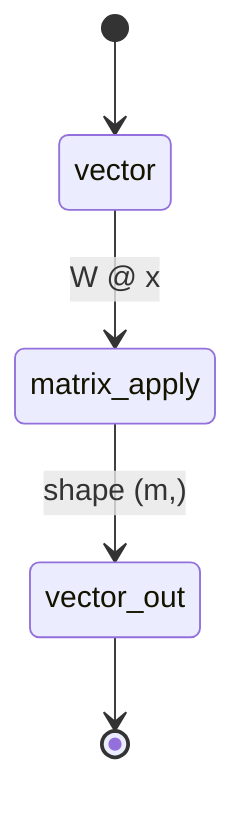

## Why this level matters (lineage)

**Classical root:** Arthur **Cayley**'s 1858 *Memoir on the Theory of Matrices* first treated an $m \times n$ block of numbers as a single algebraic object, with its own multiplication rule. James **Sylvester** coined the word *matrix* a few years earlier — originally meaning "womb", the thing from which determinants are born.
**Modern descendant:** Every line of a transformer is matrix arithmetic. The scaled-dot-product attention core is literally:

$$ \mathrm{Attention}(Q, K, V) \;=\; \mathrm{softmax}\!\left( \frac{Q K^{\top}}{\sqrt{d_k}} \right) V $$

If you understand how $Q K^{\top}$ produces an $n \times n$ table of pairwise scores, you have understood the engine of GPT.

## Objectives

- See a matrix as a **function** that takes a vector in and returns a vector out, not as a grid of numbers.
- Compute a matrix–vector product by hand and in NumPy, and predict the output shape before running the code.
- Understand that matrix multiplication is **function composition** — and why that forces it to be **non-commutative** but **associative**.

## Resources

- 3Blue1Brown *Essence of Linear Algebra*, episodes **E3 (Linear transformations)**, **E4 (Matrix multiplication as composition)**.
- Deisenroth et al., *MML* **§2.3–2.6**.
- Strang, *Introduction to Linear Algebra*, §2.1–2.4.

## Tasks

- [ ] Write $A = \begin{bmatrix}2 & 0 \\ 0 & 3\end{bmatrix}$. What does it do to the vector $\begin{bmatrix}1 \\ 1\end{bmatrix}$? To a unit square? Sketch before computing.
- [ ] Do the same for a rotation by 90°: $R = \begin{bmatrix}0 & -1 \\ 1 & 0\end{bmatrix}$.
- [ ] Verify in NumPy, and notice the shape rule `(m,n) @ (n,) -> (m,)`:

```python
import numpy as np

A = np.array([[2.0, 0.0],
              [0.0, 3.0]])          # shape (2, 2)
x = np.array([1.0, 1.0])            # shape (2,)
y = A @ x                           # shape (2,)  —  y = [2, 3]

# Composition is non-commutative:
R = np.array([[0.0, -1.0],
              [1.0,  0.0]])
print(A @ R)
print(R @ A)                        # different result!
```

- [ ] Derive the attention shapes by hand: if $Q$ is $n \times d$ and $K$ is $n \times d$, what is the shape of $Q K^{\top}$? (Answer: $n \times n$ — a token-by-token score table.)
- [ ] Take the quiz in the level panel.

## Done criteria

Given a $2 \times 2$ matrix, you can describe its geometric action (scale, rotate, shear, reflect, project). You can predict the shape of any matrix product. You can state in one sentence why matrix multiplication is not commutative.

## Bridge to modern

The matrix–vector product expressed elementwise:

$$ (A\mathbf{x})_i \;=\; \sum_{j=1}^{n} A_{ij}\,x_j $$

A fully-connected neural network layer is exactly $\mathbf{y} = \sigma(W\mathbf{x} + \mathbf{b})$ — a linear transformation $W$, a translation $\mathbf{b}$, then a nonlinearity $\sigma$. Stack many of these and you have a deep network. Replace the matrix with $QK^{\top}/\sqrt{d}$ and you have attention.



Cayley wrote down the rule. You are about to spend the rest of the curriculum applying it.
