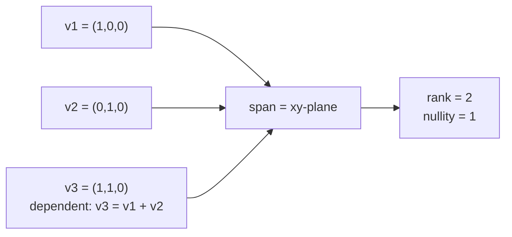

## Why this level matters (lineage)

**Classical root:** **Hermann Grassmann**'s *Ausdehnungslehre* (1844) was the first systematic treatment of *linear combinations* and *dimension* in arbitrary $n$-space — ideas so ahead of their time that mathematicians ignored them for two decades. **James Joseph Sylvester** sharpened these notions into *rank* in the 1850s, defining it as the largest order of a non-vanishing minor of a matrix.
**Modern descendant:** Rank is the silent scaffolding underneath every dimensionality-reduction technique. **PCA** (Pearson, 1901) is rank truncation of a covariance matrix. Modern **representation learning** is the working assumption that data concentrates near a low-rank manifold. And when your 70B LLM is compressed with **LoRA** or **SVD quantisation**, you are exploiting the fact that weight matrices are, empirically, *nearly low rank* — rank-revealing decompositions shave gigabytes off the model while preserving function.

## Objectives

- State what it means for a set of vectors to be **linearly independent**, and prove (or disprove) independence for small examples.
- Define **span**, **column space**, **null space**, and **rank** and say what each computes.
- Use the rank–nullity identity $\mathrm{rank}(A) + \mathrm{nullity}(A) = n$ on a $3 \times 3$ matrix.

## Resources

- 3Blue1Brown, *Essence of Linear Algebra* — episodes **E2 (Linear combinations, span, and basis)** and **E7 (Inverse matrices, column space, null space)**.
- Deisenroth et al., *MML* **§2.5–2.7** (linear independence, basis, rank).
- Strang, *Introduction to Linear Algebra*, §3.1–3.3.

## Tasks

- [ ] Definition check. A set $\{\mathbf{v}_1, \dots, \mathbf{v}_k\}$ is linearly independent iff

  $$ \sum_{i=1}^{k} c_i\,\mathbf{v}_i \;=\; \mathbf{0} \quad\Longrightarrow\quad c_1 = c_2 = \cdots = c_k = 0. $$

  Apply the definition to $\mathbf{v}_1 = (1, 0, 0)$, $\mathbf{v}_2 = (0, 1, 0)$, $\mathbf{v}_3 = (1, 1, 0)$. Are they independent? Which live in a plane?
- [ ] In NumPy, confirm with `np.linalg.matrix_rank`:

  ```python
  import numpy as np
  V = np.array([[1.0, 0.0, 1.0],
                [0.0, 1.0, 1.0],
                [0.0, 0.0, 0.0]])   # columns are v1, v2, v3
  print(np.linalg.matrix_rank(V))    # -> 2, not 3
  ```

- [ ] Build a $3 \times 3$ matrix $A$ whose rank is **2**. Compute its null space (hand or `scipy.linalg.null_space`). Verify $\mathrm{rank}(A) + \mathrm{nullity}(A) = 3$.
- [ ] One paragraph in `notes/F07.md`: *why is "low rank" a sensible assumption for the weight matrices of a trained transformer?* (Hint: think redundancy across neurons.)

## Done criteria

Given three vectors in $\mathbb{R}^3$, you can decide by inspection (or by reduced-row-echelon form) whether they are independent, and state the rank of the matrix whose columns they are. You can explain rank–nullity in one sentence.

## Bridge to modern



Two independent vectors plus one dependent one span a plane, not a volume. The dependent vector is redundant — it carries no new direction. Every time you hear "**low-rank adaptation**", "**spectral norm regularisation**", or "**bottleneck layer**", the underlying question is the same one Grassmann asked in 1844: *how many genuinely different directions are in this set?*
