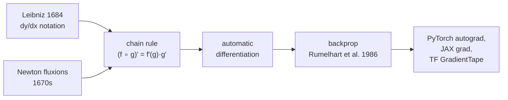

## Why this level matters (lineage)

**Classical root:** **Gottfried Wilhelm Leibniz** published the first calculus paper in 1684 (*Nova methodus pro maximis et minimis*), introducing the $dy/dx$ notation that we still use today; Isaac Newton had independently developed the same ideas through his *fluxions* a decade earlier. Their bitter priority dispute lasted decades, but the modern consensus is that both invented calculus independently. Leibniz's notation won because it made the **chain rule** — the rule for differentiating compositions — look like a plain fraction cancellation: $\frac{dz}{dx} = \frac{dz}{dy}\frac{dy}{dx}$.
**Modern descendant:** The chain rule is the single idea that makes **backpropagation** possible. Rumelhart, Hinton, and Williams (1986) "discovered" backprop by noticing that an arbitrarily deep composition of differentiable functions can be differentiated by repeated application of the chain rule, cached left-to-right through the network. Every call to `loss.backward()` in PyTorch, every `tf.GradientTape` in TensorFlow, every `jax.grad` in JAX is Leibniz's rule executed over a computational graph. **Automatic differentiation** is simply the chain rule, industrialised.

## Luminary spotlight — Gottfried Wilhelm Leibniz (1646–1716)

Leibniz was a polymath diplomat, librarian, and philosopher who invented differential calculus *and* the binary number system — the one with only `0` and `1` — that every digital computer on Earth, including the GPU training your next model, still uses at its lowest level. He wrote in a 1703 essay (*Explication de l'Arithmétique Binaire*) that binary arithmetic revealed a kind of "creation from nothing": every number built from presence and absence. His bitter feud with Newton over priority for the calculus poisoned English mathematics for a century — Britain stuck with Newton's awkward dot-notation and fell behind continental analysis until well into the 1800s. The $dy/dx$ you write today, the $\int$ sign, the binary arithmetic of the machine reading this: three pieces of Leibniz live on every page of modern ML.

## Objectives

- State the derivative as a limit and compute it for simple functions by hand.
- Apply the **chain rule** to nested compositions of functions.
- See how the chain rule is the engine of backpropagation, and verify a hand-computed derivative using PyTorch's `autograd`.

## Resources

- Spivak, *Calculus*, Chapter 9 (derivatives) and Chapter 10 (differentiation rules).
- 3Blue1Brown, *Essence of Calculus*, episodes **E2 (The paradox of the derivative)**, **E3 (Derivative formulas through geometry)**, **E4 (Visualizing the chain rule)**.
- Baydin et al. (2018), *Automatic Differentiation in Machine Learning: a Survey* — skim §2 for how autodiff implements the chain rule.

## Tasks

- [ ] Write down the limit definition. The derivative of $f$ at $a$ is

  $$ f'(a) \;=\; \lim_{h \to 0} \frac{f(a + h) - f(a)}{h}. $$

  Use it to compute $f'(x)$ for $f(x) = x^2$ from scratch (answer: $2x$), and convince yourself the limit exists by the ε-δ machinery from F10.

- [ ] State and apply the **chain rule**. For differentiable $f$ and $g$,

  $$ (f \circ g)'(x) \;=\; f'(g(x))\,g'(x). $$

  Differentiate $h(x) = \sin(x^2)$ by hand (answer: $2x\cos(x^2)$).

- [ ] **Verify with PyTorch autograd.** Run the following and confirm it prints `2.0` and `True`:

  ```python
  import torch

  x = torch.tensor(1.0, requires_grad=True)
  y = x ** 2                 # forward: y = x^2
  y.backward()               # reverse: chain rule, one node
  print(x.grad)              # should print tensor(2.)

  # a deeper composition: h(x) = sin(x^2)
  x = torch.tensor(1.0, requires_grad=True)
  h = torch.sin(x ** 2)
  h.backward()
  expected = 2 * 1.0 * torch.cos(torch.tensor(1.0 ** 2))
  print(torch.allclose(x.grad, expected))   # True
  ```

- [ ] One paragraph in `notes/F11.md`: *why is the chain rule "the whole content" of backpropagation?* (Hint: a deep network is $f_L \circ f_{L-1} \circ \cdots \circ f_1$; differentiating it with respect to any weight is a single, mechanical application of the chain rule.)

## Done criteria

You can state the derivative as a limit, apply the chain rule by hand to a two-level composition, and explain in one sentence why `loss.backward()` is Leibniz's rule running over a DAG.

## Bridge to modern



The chain rule as we will use it in F14 and every subsequent deep-learning level:

$$ \frac{\partial \mathcal{L}}{\partial \theta_i} \;=\; \frac{\partial \mathcal{L}}{\partial z_L}\,\frac{\partial z_L}{\partial z_{L-1}}\cdots \frac{\partial z_{k+1}}{\partial \theta_i}. $$

When you call `loss.backward()`, PyTorch walks the computational DAG right-to-left and multiplies the local Jacobians. That is Leibniz's 1684 rule, running on a GPU.
