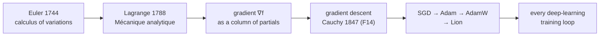

## Why this level matters (lineage)

**Classical root:** **Joseph-Louis Lagrange** reformulated mechanics in his *Mécanique analytique* (1788) by writing the motion of a system as the extremum of an action functional — a problem that demanded derivatives with respect to *many* variables at once. **Leonhard Euler**'s parallel work on the **calculus of variations** introduced the first systematic use of partial derivatives and the Euler–Lagrange equation. Between them, they turned the single-variable calculus of Newton and Leibniz into the vector calculus that governs fields, flows, and — eventually — loss landscapes.
**Modern descendant:** The **gradient** $\nabla f$ is the vector of partial derivatives, and it points in the direction of steepest ascent. Every gradient-based optimiser in deep learning — SGD, Momentum, Adam, AdamW, Lion — is a walk in the *opposite* direction of this vector. When you read "we minimise the loss by following the negative gradient", you are standing on 240 years of vector calculus. The **Jacobian** (a matrix of partial derivatives) and the **Hessian** (partials of partials) are the next two tools you will meet in F13.

## Objectives

- State and compute **partial derivatives** $\partial f / \partial x_i$ for functions of several variables.
- Assemble the **gradient vector** $\nabla f$ and interpret it geometrically as the direction of steepest ascent.
- Verify a hand-computed gradient against `torch.autograd`.

## Resources

- Deisenroth et al., *MML* **§5.1–5.3** (differentiation of multivariate functions, partial derivatives, gradient).
- 3Blue1Brown, *Multivariable Calculus* (Khan Academy series) — **Partial derivatives**, **Gradient**, **Directional derivatives**.
- Spivak, *Calculus on Manifolds*, Chapter 2 — for the rigorous version, if you feel like stretching.

## Tasks

- [ ] Write down the definitions. For $f : \mathbb{R}^n \to \mathbb{R}$, the partial derivative with respect to $x_i$ is

  $$ \frac{\partial f}{\partial x_i}(\mathbf{x}) \;=\; \lim_{h \to 0} \frac{f(\mathbf{x} + h\mathbf{e}_i) - f(\mathbf{x})}{h}, $$

  and the **gradient** is the column vector of partials:

  $$ \nabla f(\mathbf{x}) \;=\; \begin{bmatrix} \partial f / \partial x_1 \\ \partial f / \partial x_2 \\ \vdots \\ \partial f / \partial x_n \end{bmatrix}. $$

- [ ] **By hand.** For $f(x, y) = x^2 + y^2$, compute

  $$ \frac{\partial f}{\partial x} = 2x, \qquad \frac{\partial f}{\partial y} = 2y, \qquad \nabla f(1, 2) = \begin{bmatrix} 2 \\ 4 \end{bmatrix}. $$

  The vector $\begin{bmatrix} 2 \\ 4 \end{bmatrix}$ points away from the origin in the direction of steepest *ascent*; negating it gives the direction of steepest descent used in F14.

- [ ] **Verify with autograd.**

  ```python
  import torch

  x = torch.tensor(1.0, requires_grad=True)
  y = torch.tensor(2.0, requires_grad=True)
  f = x ** 2 + y ** 2
  f.backward()
  print(x.grad, y.grad)        # tensor(2.) tensor(4.)

  # vectorised version
  p = torch.tensor([1.0, 2.0], requires_grad=True)
  g = (p ** 2).sum()
  g.backward()
  print(p.grad)                # tensor([2., 4.])
  ```

- [ ] **Geometric intuition.** Sketch the surface $z = x^2 + y^2$ (a paraboloid / "bowl"). At $(1, 2)$ the gradient $(2, 4)$ lies in the $xy$-plane pointing outward; the steepest uphill direction of the surface is the 3D lift of this 2D arrow. Convince yourself that $\nabla f$ is always *perpendicular* to the level curves of $f$.

- [ ] One paragraph in `notes/F12.md`: *why does every deep-learning optimiser update weights in the direction of $-\nabla \mathcal{L}$ rather than along an axis-aligned partial?*

## Done criteria

You can compute a gradient by hand for a 2-variable polynomial, match it with `torch.autograd`, and state in one sentence that the gradient points in the direction of steepest ascent, perpendicular to level sets.

## Bridge to modern



The gradient of a scalar loss with respect to a parameter vector $\boldsymbol{\theta} \in \mathbb{R}^n$ is

$$ \nabla_{\boldsymbol{\theta}} \mathcal{L}(\boldsymbol{\theta}) \;=\; \left[\frac{\partial \mathcal{L}}{\partial \theta_1}, \frac{\partial \mathcal{L}}{\partial \theta_2}, \ldots, \frac{\partial \mathcal{L}}{\partial \theta_n}\right]^{\top}. $$

In F14 we will take a small step in the direction $-\nabla_{\boldsymbol{\theta}} \mathcal{L}$ and call it **gradient descent**. Everything else in optimisation — momentum, adaptive rates, second-order corrections — is a refinement of that one move.
