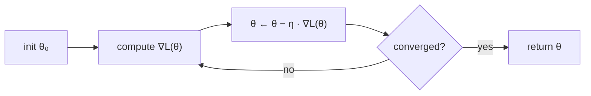

## Why this level matters (lineage)

**Classical root:** **Augustin-Louis Cauchy** published the first algorithmic use of the gradient in 1847 — *Méthode générale pour la résolution des systèmes d'équations simultanées* — proposing that to minimise a function one should move in the direction of the negative gradient. He used it to solve astronomical orbit equations. It took 177 years and a few billion matrix multiplications, but it is now how every neural network on Earth is trained.
**Modern descendant:** Cauchy's steepest descent is the direct ancestor of **SGD** (Robbins & Monro, 1951), **Momentum** (Polyak, 1964; Nesterov, 1983), **AdaGrad** (Duchi et al., 2011), **RMSProp** (Tieleman & Hinton, 2012), **Adam** (Kingma & Ba, 2014), **AdamW** (Loshchilov & Hutter, 2017), and **Lion** (Chen et al., 2023). Every deep-learning model — from a MNIST MLP to GPT-4 — was trained by walking downhill on a loss surface using a refinement of the 1847 idea.

## Objectives

- Derive the gradient-descent update rule from a first-order **Taylor expansion** of the loss.
- Understand the **learning rate** $\eta$ geometrically: step too big and you overshoot, too small and you crawl.
- Implement vanilla GD on a 2D quadratic bowl and visualise how the trajectory changes with $\eta$.

## Resources

- Deisenroth, Faisal, Ong, *Mathematics for Machine Learning* **§7.1** — primary reading.
- 3Blue1Brown, *Gradient descent, how neural networks learn* — the visual companion.
- Optional deep cut: Boyd & Vandenberghe, *Convex Optimization* **§9.3** (gradient method, convergence analysis).

## Tasks

- [ ] Work through **Deisenroth §7.1 problems 1–4** on paper. Derive the update rule from a first-order Taylor expansion: given $\mathcal{L}(\boldsymbol{\theta} + \Delta\boldsymbol{\theta}) \approx \mathcal{L}(\boldsymbol{\theta}) + \nabla \mathcal{L}(\boldsymbol{\theta})^{\top} \Delta\boldsymbol{\theta}$, pick $\Delta\boldsymbol{\theta} = -\eta \nabla \mathcal{L}(\boldsymbol{\theta})$ to *decrease* $\mathcal{L}$ to first order.

- [ ] Code `gd.py` — minimise $f(x, y) = x^2 + 10y^2$ and plot the trajectory for three learning rates: $\eta = 0.01$ (too small, slow), $\eta = 0.1$ (goldilocks), $\eta = 0.11$ (too big — the narrow $y$-axis starts to oscillate).

  ```python
  import numpy as np
  import matplotlib.pyplot as plt

  def f(x, y):
      return x ** 2 + 10 * y ** 2

  def grad(x, y):
      return np.array([2 * x, 20 * y])

  def descent(lr=0.1, steps=40, start=(5.0, 3.0)):
      path = [np.array(start)]
      for _ in range(steps):
          p = path[-1]
          path.append(p - lr * grad(*p))
      return np.array(path)

  path = descent(lr=0.1)
  plt.plot(path[:, 0], path[:, 1], marker="o")
  plt.title("GD on f(x,y) = x^2 + 10y^2")
  plt.show()
  ```

- [ ] Write a one-paragraph *what I learned* note in `notes/F14.md` explaining, in your own words, why a learning rate that is too high oscillates along the steep axis while a rate that is too low stalls along the shallow one.

## Done criteria

All three tasks checked. You can explain (aloud, to yourself, without notes) **why a learning rate that is too high oscillates and one that is too low stalls**, and you have three saved plots showing the three regimes on the same bowl.

## Luminary spotlight — Augustin-Louis Cauchy (1789–1857)

Cauchy was a French mathematician who, in a short 1847 note, described the **method of steepest descent** — step in the direction of the negative gradient — to solve astronomical orbit equations. The same man gave us the $\varepsilon$-$\delta$ formalisation of limits, the residue theorem in complex analysis, and the Cauchy–Schwarz inequality; the entire deep-learning stack rests on machinery he built two centuries before there was anything to optimise. *Worth remembering:* he published over 800 papers, more than anyone else in the nineteenth century, and his collected works run to twenty-seven volumes. Every time you call `optimizer.step()`, you are running his 1847 algorithm on a GPU.

## Bridge to modern

Once done, **P04 (Kingma & Ba — Adam)** becomes readable. Adam's entire innovation — *per-parameter adaptive* learning rates with momentum and variance correction — is a direct extension of the step-size geometry you just built intuition for. Where vanilla GD uses a single scalar $\eta$ for every dimension, Adam maintains a per-parameter estimate of gradient magnitude and takes larger steps in flat directions, smaller in steep ones. If $f(x, y) = x^2 + 10y^2$ taught you that one $\eta$ for two very different axes is awkward, Adam is the obvious fix.

## The update rule



$$ \boldsymbol{\theta}_{t+1} \;=\; \boldsymbol{\theta}_t \;-\; \eta \, \nabla_{\boldsymbol{\theta}} \mathcal{L}(\boldsymbol{\theta}_t). $$

One arrow, one step, repeated until the loss stops going down. That is the whole algorithm — and with the right refinements, the whole of modern deep learning.
